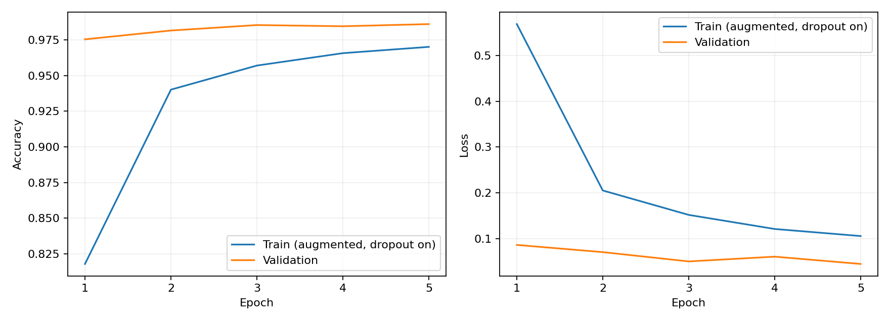
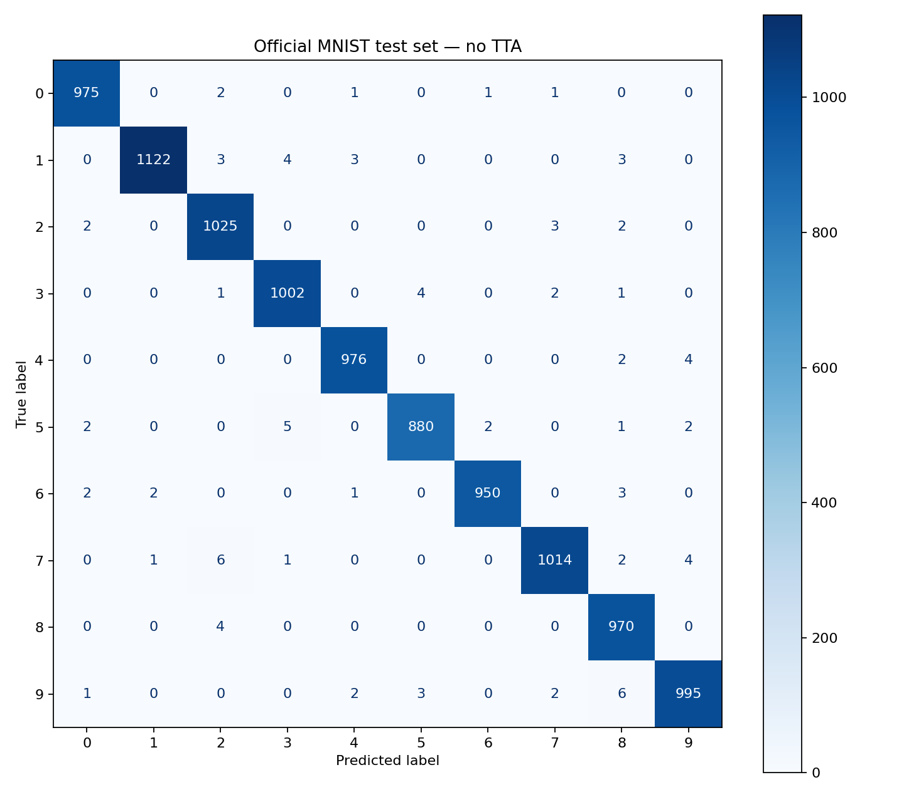

# Handwritten Digit Recognizer

A desktop application for recognizing handwritten digits with a convolutional neural network, TensorFlow/Keras, OpenCV, and Tkinter.

- Draw one or more digits; recognize manually or automatically after a 1.5-second pause.
- Load PNG, JPEG, or BMP images, including images with transparency.
- Recognize digits from a webcam with an adjustable region of interest (ROI).
- Adjust the brush with the mouse wheel; clear the canvas at any time outside camera mode.
- Train reproducibly, export learning curves and a confusion matrix, and compare inference policies.

## Quick start

Use **Python 3.10 or 3.11** (tested with 3.11). TensorFlow/Keras 2.15 is pinned because the original HDF5 model and augmentation API use Keras 2.

```bash
git clone https://github.com/Bandoof/digit-recognizer.git
cd digit-recognizer
python -m venv .venv
source .venv/bin/activate         # Windows: .venv\Scripts\activate
python -m pip install -r requirements.txt
python -m digit_recognizer.gui
```

Tkinter and a graphical desktop are required. On Ubuntu/Debian, install `python3-tk` and `libgl1` if absent. Some Python distributions require their own Tk package. The app runs on CPU; CUDA is optional. Grant webcam permissions to Python/your terminal and close other applications holding the camera.

To choose a camera, model, or disable TTA:

```bash
python -m digit_recognizer.gui --camera-index 1 --tta none
python -m digit_recognizer.gui --model artifacts/mnist-seed42/model.keras
```

The default is the bundled `models/mnist.h5`. The newly measured results below belong to a separately trained model, **not** to this legacy checkpoint. A newly trained checkpoint is stored in the chosen output directory; it is not committed automatically.

## CNN architecture

The architecture is unchanged: **93,322 trainable parameters**.

| Layer | Output shape (excluding batch) |
| --- | --- |
| Grayscale input, scaled to [0, 1] | 28 × 28 × 1 |
| Conv2D, 32 filters, 3 × 3, ReLU, valid padding | 26 × 26 × 32 |
| MaxPooling2D, 2 × 2 | 13 × 13 × 32 |
| Conv2D, 64 filters, 3 × 3, ReLU, valid padding | 11 × 11 × 64 |
| MaxPooling2D, 2 × 2 | 5 × 5 × 64 |
| Conv2D, 64 filters, 3 × 3, ReLU, valid padding | 3 × 3 × 64 |
| Flatten | 576 |
| Dense, 64 units, ReLU | 64 |
| Dropout, rate 0.5 | 64 |
| Dense, 10 units, softmax | 10 |

Training uses Adam and categorical cross-entropy. Augmentation applies small rotations, zoom, and horizontal/vertical translations to **training data only**. No mirrored digits are used for training or production TTA.

## Training and evaluation

```bash
python -m digit_recognizer.training --output-dir artifacts/mnist-seed42 --epochs 5 --seed 42
```

Keras downloads MNIST from `storage.googleapis.com` on first use. For offline or restricted environments, supply a local standard MNIST archive:

```bash
python -m digit_recognizer.training \
  --data-path /path/to/mnist.npz \
  --output-dir artifacts/mnist-seed42 --epochs 5 --seed 42
```

The archive must contain `x_train`, `y_train`, `x_test`, and `y_test`, retaining the official MNIST partitions. Images are uint8 arrays of shape `(N, 28, 28)` and labels are integer digits 0–9. Use an official or checksum-verified dataset; see [run provenance](reports/README.md).

The default split is:

| Partition | Images | Purpose |
| --- | ---: | --- |
| Train | 54,000 | Gradient updates and augmentation |
| Validation | 6,000 | Stratified 10% of the original 60,000 training images; checkpoint selection |
| Test | 10,000 | Official test partition; final evaluation after training |

The split and augmentation use seed 42. The checkpoint with the **lowest validation loss** is saved and reloaded before test evaluation. Test data is never passed to `fit`, used for checkpoint selection, or used to choose TTA settings. TensorFlow deterministic operations are enabled; exact results can still differ across hardware/software versions.

Each run needs a new output directory, preventing accidental overwrites. It contains:

- `model.keras`: best validation checkpoint, loadable with `--model`.
- `metrics.json`: test metrics, full history, per-class precision/recall/F1, confusion counts, seeds, split sizes, and model hash.
- `learning_curves.png`: train/validation accuracy and loss by epoch.
- `confusion_matrix.png`: final test predictions without TTA.

### Measured run

A full five-epoch CPU run on **2026-10-08**, TensorFlow 2.15.1, seed 42, batch size 64:

| Metric | Result |
| --- | ---: |
| Selected epoch | 5 |
| Validation accuracy at selected epoch | 98.60% |
| Validation loss at selected epoch | 0.04470 |
| Test accuracy, no TTA | **99.09%** (9,909 / 10,000) |
| Test loss, no TTA | 0.02952 |

These are recorded measurements, not a claim about accuracy on arbitrary handwriting or camera frames. Training accuracy is measured with augmentation and dropout enabled, so it is not directly comparable to validation accuracy. The historical checkpoint's training provenance is not established by this run.




Raw results: [metrics.json](reports/metrics.json). Reproduction details and limitations: [reports/README.md](reports/README.md).

## Faster inference and image processing

The preprocessing pipeline handles EXIF orientation and alpha transparency, identifies light/dark backgrounds, thresholds and filters noise, finds contours from left to right, preserves aspect ratio, deskews digits, and centers them in 28 × 28 crops. Empty images produce “No digits found” instead of an arbitrary prediction.

`--tta fast` uses **five views**: the original crop and four zero-padded two-pixel translations. All digits and their views are processed in bounded batches with a direct `model(..., training=False)` call. The original policy used 17 views and called `model.predict` for each digit; it also included horizontal and vertical flips, which can change digit identity. `--tta none` uses one view.

The measured comparison uses the new trained checkpoint and the same **1,000 validation images**, three timed repetitions, with a warmup before each policy. It uses original MNIST crops, excludes GUI preprocessing, and never uses test images for policy selection:

| Policy | Views per digit | Validation accuracy | Median ms/digit |
| --- | ---: | ---: | ---: |
| Original implementation | 17 | 99.40% | 45.30 |
| Fast TTA | 5 | 99.40% | 5.07 |
| No TTA | 1 | 99.00% | 4.47 |

Fast TTA was **8.93× faster** in this environment with no measured accuracy reduction on this sample. This includes the improvement from removing `model.predict` overhead, not just fewer views; timings are hardware-dependent. The comparison is a validation measurement on clean MNIST, not a real-camera accuracy guarantee or a statistically proven equivalence claim.

```bash
python -m digit_recognizer.benchmark \
  --model artifacts/mnist-seed42/model.keras \
  --samples 1000 --repeats 3 \
  --output artifacts/tta-benchmark.json
# Add --data-path /path/to/mnist.npz when working offline.
```

Raw measurements: [tta-benchmark.json](reports/tta-benchmark.json). Use the same `--seed` and `--validation-fraction` as training; the benchmark defaults to the 10% validation split and seed 42.

The default bundled checkpoint was also checked on the same subset: both original and fast TTA classified 995/1,000 correctly. Its historical training split is unknown, so this is a compatibility comparison, not an independent accuracy estimate. See [bundled-model comparison](reports/tta-bundled-model.json).

## GUI stability and limitations

Inference and camera capture run in background workers. Only the Tk main thread updates widgets. Inference requests are bounded and serialized; stale results are discarded after drawing, clearing, or switching modes. Camera previews reuse one canvas item, and the ROI is extracted **before** the preview border is drawn. Closing the window cancels timers and requests worker shutdown; camera resources are released by the capture worker.

Image-loading errors, unavailable cameras, disconnected/empty camera frames, invalid model output, and inference failures are surfaced in the UI. Camera capture runs off the UI thread so a slow driver cannot freeze the interface. A driver blocked indefinitely in a read can delay device release; restarting the camera waits for the previous worker to stop.

Known limitations:

- Multiple separated digits are supported; touching/overlapping digits and multi-line reading order are not reliably segmented.
- Softmax scores are model confidence scores, not calibrated probabilities of correctness.
- MNIST performance does not establish accuracy under camera shadows, blur, perspective, or unfamiliar writing styles.
- Camera behavior is tested using simulated frames and failures. A physical webcam and interactive desktop must still be checked on the target machine.

## Tests and development

```bash
python -m pip install -r requirements-dev.txt
python -m pytest -q
ruff check .
ruff format --check .
```

For **all** GUI tests on a Linux server without a display:

```bash
sudo apt-get install xvfb xauth python3-tk libgl1
xvfb-run -a python -m pytest -q
```

GUI tests are explicitly skipped if a display cannot be created; this is not equivalent to full GUI validation. Tests need no network or MNIST download. They exercise preprocessing, batching and TTA, the bundled model, the train/validation boundary, a small synthetic training/reporting run, Tk callbacks, image-loading failures, camera resource cleanup, stale results, and shutdown. Synthetic training is a pipeline check, not an accuracy benchmark. GitHub Actions runs lint, formatting, and the complete suite under Xvfb.

## Project layout

```text
digit_recognizer/
  preprocessing.py    Image normalization and digit extraction
  inference.py        Batched production TTA
  workers.py          Camera and inference workers
  gui.py              Tkinter application
  training.py         Split, train, select, evaluate, and plot
  benchmark.py        Reproducible validation-only TTA comparison
models/mnist.h5        Bundled pretrained checkpoint
tests/                Unit and integration tests
reports/              Measured results and plots
artifacts/            Local run outputs (ignored by Git)
```

Licensed under the repository's [LICENSE](LICENSE).
